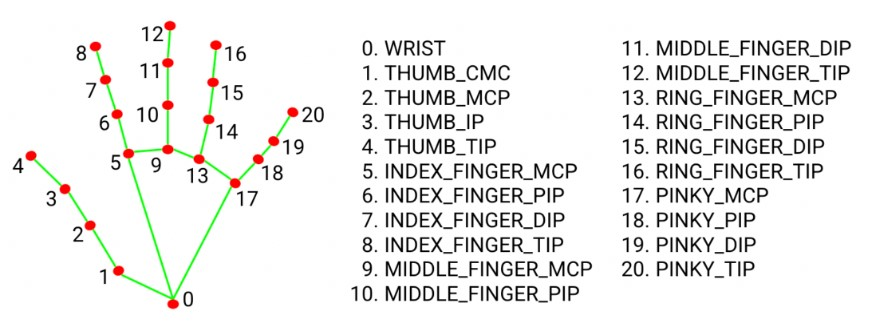
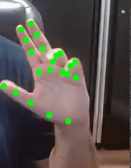

# Project Name

## Introduction
- Utilizes the Mediapipe library to perform real-time hand tracking using a webcam. 
- By initializing the hand tracking module from Mediapipe and capturing frames from the webcam, it processes each frame by detecting landmarks on the hands. 

- These landmarks are then visually highlighted on the frames, enabling users to see their hand movements in real-time. 
- The program runs in a loop, continually displaying the processed frames with the drawn landmarks. This code serves as a fundamental demonstration of hand tracking using the Mediapipe library and provides a starting point for further exploration and customization. 

### Prerequisite  
- Ensure you have **Python 3.x** installed on your system. 
- You can verify your Python version with: `python --version`

### Setting up the virtual environment 
- Create a virtual environment: `python -m venv myenv`
- Activate the virtual environment: `myenv\Scripts\activate`
- Install all the third party libraries: `pip install -r requirements.txt`

### Run the Program
- Execute the program with: `python main.py`
- It will try using your camera 
- Here is a sample of what you can expect to see after training the agent:
  - 
- Users can exit the program by pressing the 'q' key.
- Deactivate the virtual environment: `deactivate`

### References 
- https://developers.google.com/mediapipe
- https://developers.google.com/mediapipe/solutions/vision/hand_landmarker
